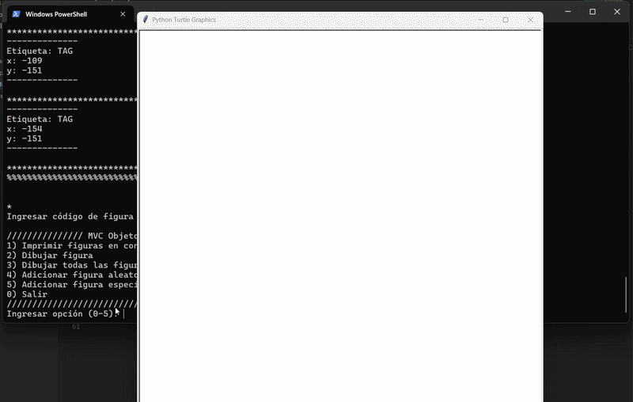

# Editor de Figuras Geométricas (MVC + GUI)

Aplicación en Python que permite crear y gestionar figuras geométricas (definidas por puntos) sobre un lienzo, implementada con el patrón de diseño **Modelo-Vista-Controlador (MVC)**. El proyecto soporta dos modos de ejecución: **consola** y **interfaz gráfica (Tkinter)**, ambos reutilizando el mismo modelo de datos.

## Demo


## Características

- Arquitectura MVC completa y desacoplada (`model`, `view`, `controller`).
- Modelo del dominio: `Punto`, `Figura` y `Lienzo`, con lógica para agregar, actualizar y consultar figuras.
- Vista de consola para interacción por texto.
- Vista gráfica (Tkinter) con formulario para crear/editar figuras y ventana principal para visualizarlas.
- Selección del modo de ejecución (consola o GUI) desde el punto de entrada.

## Tecnologías

- Python 3
- Tkinter (interfaz gráfica)
- Programación Orientada a Objetos (POO)

## Estructura del proyecto

```
mvc-figuras-gui/
├── main.py                     # Punto de entrada, selecciona modo consola/GUI
├── model/
│   ├── Punto.py
│   ├── Figura.py
│   └── Lienzo.py
├── view/
│   ├── console/
│   │   ├── Formulario.py
│   │   ├── LienzoView.py
│   │   └── Mensaje.py
│   └── gui/
│       ├── FormularioFigura.py
│       └── VentanaPrincipal.py
├── controller/
│   ├── AppConsole.py
│   └── AppGUI.py
├── assets/
│   ├── demo.gif

```

## Instalación

Este proyecto requiere la librería **Pillow** para el manejo de imágenes en la vista gráfica.

```bash
pip install -r requirements.txt
```

## Cómo ejecutarlo

```bash
python main.py
```

Por defecto la aplicación inicia en modo **consola**. Para usar la interfaz gráfica, edita la variable `modo` en `main.py` y cámbiala a `'GUI'`.

## Contexto académico

Proyecto desarrollado durante el segundo semestre de la carrera, en la asignatura de Programación Orientada a Objetos, como ejercicio de aplicación del patrón MVC combinando vistas de consola y de escritorio.
